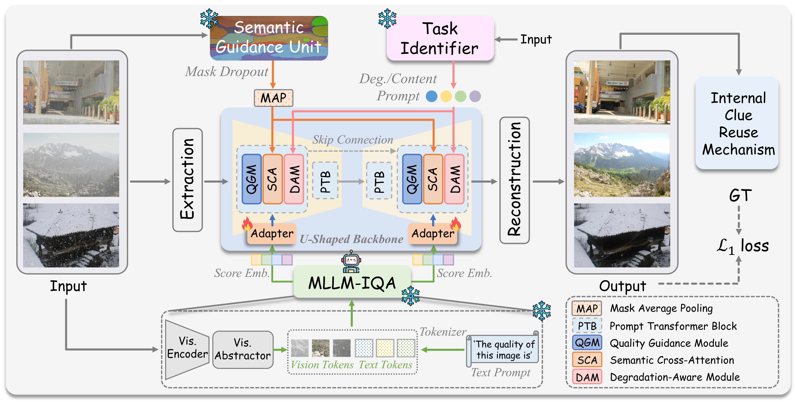

<div align="center">

## :fire: ClearAIR: A Human-Visual-Perception-Inspired All-in-One Image Restoration (AAAI'2026)

[](https://arxiv.org/abs/2601.02763)
[](LICENSE)
[](https://www.python.org/)
[](https://pytorch.org/)


</div>

---

This is the official PyTorch codes for the paper:

>**ClearAIR: A Human-Visual-Perception-Inspired All-in-One Image Restoration**<br>  [Xu Zhang<sup>1</sup>](https://house-yuyu.github.io/), [Huan Zhang<sup>2</sup>](https://scholar.google.com.hk/citations?user=bJjd_kMAAAAJ&hl=zh-CN), [Guoli Wang<sup>3</sup>](https://scholar.google.com.hk/citations?user=z-25fk0AAAAJ&hl=zh-CN), [Qian Zhang<sup>3</sup>](https://scholar.google.com.hk/citations?user=pCY-bikAAAAJ&hl=zh-CN), [Lefei Zhang<sup>1📧</sup>](https://scholar.google.com.hk/citations?user=BLKHwNwAAAAJ&hl=zh-CN)<br>
> <sup>1</sup>Wuhan University, <sup>2</sup>Guangdong University of Technology, <sup>3</sup>Horizon Robotics<br>
> <sup>📧</sup>Corresponding author.




:star: If ClearAIR is helpful to your images or projects, please help star this repo. Thank you! :point_left:


## Status and scope

ClearAIR follows the coarse-to-fine human-visual-perception order described in the paper:
global quality assessment (**How**), semantic region awareness (**Where**), local degradation recognition
(**What**), then internal-clue reuse for fine details. 


## Installation

Python 3.10+ and PyTorch 2.5.1+ are recommended for the real auxiliary stack. Use an isolated environment and
install a PyTorch build appropriate for your CUDA runtime first:

```bash
git clone https://github.com/House-yuyu/ClearAIR.git
cd ClearAIR
conda create -n clearair python=3.11 -y
conda activate clearair
# Install the desired torch/torchvision CUDA build, then:
bash scripts/setup_real_aux.sh
```

`setup_real_aux.sh` pins `transformers==4.46.3`, installs the official DA-CLIP and SAM2 repositories, applies
small device/PyTorch compatibility patches, and downloads approximately 18GB of frozen checkpoints into
`pretrained/`:

```text
pretrained/
├── DeQA-Score-Mix3/                  # 8B DeQA, four safetensors shards
├── daclip/daclip_ViT-B-32.pt
└── sam2/sam2.1_hiera_tiny.pt
```

The external repositories and weights are intentionally ignored by git. Their upstream sources are
[`zhiyuanyou/DeQA-Score`](https://github.com/zhiyuanyou/DeQA-Score),
[`facebookresearch/sam2`](https://github.com/facebookresearch/sam2), and
[`Algolzw/daclip-uir`](https://github.com/Algolzw/daclip-uir).

Validate the package and a complete forward/loss/backward path on CPU:

```bash
python -m clearair.smoke_test --quick --device cpu
python -m unittest discover -s tests -v
```

The full smoke test uses the paper-scale 256x256 configuration and is intentionally more demanding:

```bash
python -m clearair.smoke_test --device cuda
```

## Training

The defaults follow the paper's optimizer and crop settings: AdamW, learning rate `2e-4`, batch size `4`,
and 300K iterations. Train with all three real frozen auxiliaries using:

```bash
clearair-train \
  --no-dummy-aux \
  --data-root /path/to/aioir_data \
  --degradations denoise dehaze derain \
  --save-dir checkpoints/three_deg \
  --device cuda
```

DeQA is loaded in NF4 by default. On a multi-GPU machine the frozen models can be placed on a separate GPU:

```bash
clearair-train --no-dummy-aux --device cuda:0 --aux-device cuda:1 \
  --data-root /path/to/aioir_data --degradations denoise dehaze derain
```

For the lightweight engineering path, omit `--no-dummy-aux`. Dummy checkpoints are not comparable with the
paper. If one GPU cannot hold the paper batch size, reduce `--batch-size` or move auxiliaries to another GPU.

Useful options:

```bash
clearair-train --help
```

Checkpoints contain the restoration model and trainable adapters, optimizer, scheduler, iteration, and model
configuration. Frozen DeQA/SAM2/DA-CLIP weights are deliberately excluded. Resume a compatible run with:

```bash
clearair-train --data-root /path/to/aioir_data --resume checkpoints/three_deg/clearair_iter10000.pth
```

## Inference

The inference command accepts one image or a directory and pads images to a multiple of eight before
restoration. Pass `--no-dummy-aux` for a checkpoint trained with the real stack:

```bash
clearair-infer \
  --no-dummy-aux \
  --checkpoint checkpoints/three_deg/clearair_iter300000.pth \
  --input /path/to/degraded_images \
  --output outputs/restored \
  --device cuda
```

No official pretrained ClearAIR restoration checkpoint is currently bundled with this repository.

## Real auxiliary implementation

- **DeQA-Score-Mix3** is frozen and loaded in NF4. ClearAIR extracts the final 4096-dimensional prompt state
  that predicts the quality adjective, rather than reducing DeQA to a scalar score.
- **SAM2.1 Hiera-Tiny** uses Meta's official automatic mask generator. A 4x4 point grid produces candidates,
  ranked masks are truncated/padded to the configured 16 semantic regions, and mask dropout is applied in
  training.
- **DA-CLIP ViT-B/32** returns normalized 512-dimensional content and degradation embeddings from the
  official controlled OpenCLIP implementation.

All three models run under `torch.inference_mode()` and stay outside the ClearAIR module state dict. Their
outputs are cloned at the frozen/trainable boundary so the small ClearAIR adapters can backpropagate safely.
The verified one-iteration command, outputs, environment, and weight checksums are recorded in
[`docs/REAL_AUX_SMOKE.md`](docs/REAL_AUX_SMOKE.md).


## License

This code is released under the [MIT License](LICENSE).

## :book: Citation

If you find our repo useful for your research, please consider citing our paper:

```bibtex
@article{ClearAIR,
title={ClearAIR: A Human-Visual-Perception-Inspired All-in-One Image Restoration}, volume={40}, 
number={15}, 
journal={Proceedings of the AAAI Conference on Artificial Intelligence}, 
author={Zhang, Xu and Zhang, Huan and Wang, Guoli and Zhang, Qian and Zhang, Lefei}, 
year={2026}, 
month={Mar.}, 
pages={12861–12869} 
}
```

## :postbox: Contact

If you have any questions, please feel free to reach us out at <a href="zhangx0802@whu.edu.cn">zhangx0802@whu.edu.cn</a>.

<div align="center">


